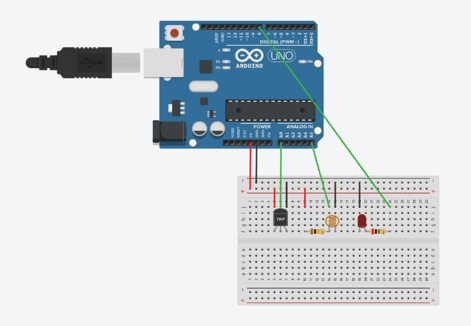

-   [1 Abstract](#abstract)
-   [2 Einleitung](#einleitung)
    -   [2.1
        Fragestellung](#fragestellung)
    -   [2.2
        Motivation](#motivation)
    -   [2.3
        Literatur-Review](#literatur-review)
-   [3 Experimenteller
    Teil](#experimenteller-teil)
    -   [3.1
        Informationsquellen](#informationsquellen)
    -   [3.2
        Prinzipskizze](#prinzipskizze)
    -   [3.3
        Hardware](#hardware)
    -   [3.4
        Software](#software)
-   [4 Resultate](#resultate)
-   [5 Diskussion](#diskussion)
-   [6
    Zusammenfassung](#zusammenfassung)
-   [7 Danksagung](#danksagung)
-   [8
    Interessenskonflikte](#interessenskonflikte)
-   [Quellenverzeichnis](#quellenverzeichnis)

Abstract
========

In der vorliegenden Arbeit wurde untersucht, wie ein Arduino Uno über
eine WebSocket-Verbindung gesteuert werden kann, während dieser im
Sekundentakt Statusmeldungen versendet.

Der verwendete Funduino Uno R3 \[[1](#ref-lernset)\] verfügt über keine
WLAN-Schnittstelle. Daher erfolgt die WebSocket-Kommunikation extern auf
einem Gateway. Als Gateway wird ein Windows-PC verwendet. Arduino und
Gateway sind per USB verbunden und kommunizieren über eine virtuelle
serielle Schnittstelle.

Das Ergebnis zeigt, dass eine Steuerung eines Arduinos per WebSocket
problemlos möglich ist. Die eingehenden Nachrichten müssen auf dem
Arduino geparst werden. Dieses Parding ist einfacher, wenn das
verwendete Austauschformt schlank gehalten wird. Deshalb wurde anstelle
von JSON das URL Format verwendet.

Einleitung
==========

In diesem Kapitel wird die Motivation erläutert und genaue Fragesellung
definiert. Dann folgt eine kleine Übersichtsarbeit mit dazugehöriger
Literaturrecherche.

Fragestellung
-------------

Welche Möglichkeiten gibt es, einen Arduino Uno via Websocket zu
steuern?

Während einer explorativen Online-Suche wurden einzelne Lösungen
gefunden. Eine systematische Zusammenstellung der Möglichkeiten fehlt
jedoch.

Motivation
----------

Die Motivation für die vorliegende Arbeit ist die Beantwortung der
nachfolgenden Fragestellung. Weiter soll der Artikel interessierten
Lesern als Einstiegslektüre diesen.

Literatur-Review
----------------

Zum Thema existiert diverse Fachliteratur unter anderem von Erik
Bartmann \[[2](#ref-bartmannArduino)\] \[[3](#ref-bartmannESP8266)\]
\[[4](#ref-bartmannESP32)\].

### Arduino mit integriertem WLAN

Der Arduino Uno hat keine eingebaute WLAN Schnittstelle. Es gibt jedoch
andere Arduino Modelle mit integriertem WLAN, wie z.B. der Arduino
MKR1000.

### WLAN Erweiterung

Mehrere Autoren berichten \[[5](#ref-temperatureDashboard)\]
\[[6](#ref-websocketcommunication)\], wie der Arduino mit dem dem WLAN
Modul ESP8266 erweitert werden kann.

### Serial Gateway

Eine weitere Möglichkeit, ist behelfsweise einen PC als Serial Gateway
einzusetzen. Mangels kurzfristig verfügbarer Hardware wollen wir diese
Option verfolgen.

Experimenteller Teil
====================

Informationsquellen
-------------------

Als Informationsquellen sind die Datenblätter zur jweiligen Hardware
sowie die Manuals zu den einsesetzten Softwarekomponenten zu nennen.

Prinzipskizze
-------------

Hardware
--------

Verwendet wurde das Lernset Nr. 8 von Funduino \[[1](#ref-lernset)\].
Darin enthalten ist ein Funduino Uno. Weiter benötigen wir den
Temparatursensor TMP36 und den Fotowiderstand.

### Anschluss der Sensoren

Software
--------

### Entwicklungsumgebung

Zur Entwicklung wurde folgende Software eingesetzt.

-   Visual Studio Code \[[7](#ref-vscode)\] mit der Erweiterung C/C++
    IntelliSense \[[8](#ref-intellisense)\]
-   Arduino CLI \[[9](#ref-arduinoCli)\]
-   Git for Windows \[[10](#ref-gitForWindows)\] und TortoiseGit
    \[[11](#ref-tortoiseGit)\]

Nicht verwendet wurde die Arduino IDE. Windows verwendet den
Standardtreiber *usbser.sys* für den virtuellen COM Port.

### Node Libraries

Weiter wurde folgende NPM Packages eingesetzt:

-   WebSockets \[[12](#ref-websockets)\]
-   Express \[[13](#ref-express)\]
-   Chart.js \[[14](#ref-chartjs)\]
-   SerialPort \[[15](#ref-serialPort)\]

### Arduino Libraries

Weiter wurde folgende Arduino Libraries eingesetzt:

-   Arduino Library (Arduino.h) \[[16](#ref-sprachreferenz)\]
    \[[17](#ref-codeReferenz)\] \[[18](#ref-arduinoCheatSheet)\]  
-   AVR Libc \[[19](#ref-avrlibc)\]

### Arduino Sketch

Zunächst müssen wir klären, in welcher Programmiersprache die Arduino
Sketches geschrieben werden. Nachdem man sich die Build-Umgebung genauer
unter die Lupe genommen hat, wird klar, dass keine eigene
Arduino-Sprache existiert\[[20](#ref-arduinoLanguage)\]. Im Hintergrund
wird aus dem Sketch eine C++ Datei erstellt und mit *avr-g++*
kompiliert.

Die Problematik der Heap-Fragmentierung wird von mehreren Autoren
aufgeworfen und diskutiert
\[[21](#ref-heapFragmentation)\]\[[22](#ref-heapFragmentation2)\]. Matt
ist der Meinung, dass man deshalb auf die String Klasse in der Arduino
Library gänzlich verzichten soll \[[23](#ref-arduinoStrings)\]. In der
Konsequenz müsste man die Stringfunktion aus der Standard C Library
\[[19](#ref-avrlibc)\] verwenden und in C programmieren. Ich sehe dies
nicht ganz so eng und setze die Arduino String Klasse trotzdem, jedoch
mit Zurückhaltung ein. Ich befolge Matt’s Rat, die Variablen by
Reference zu übergeben \[[23](#ref-arduinoStrings)\].

Der Quellcode befindet sich im Ordner Arduino. Darin befinden sich
verschiedene Sketech, darunter
[genericReadWrite](../../arduino/genericReadWrite/genericReadWrite.ino)

### Serial Gateway

Der Quellcode befindet sich im Ordner
[Gateway](../../gateway/gateway.js).

### WebSocket Server

Der Quellcode befindet sich im Ordner
[WebSocketServer](../../websocketserver/websocketserver.js).

### Web GUI

Der Quellcode befindet sich im Ordner [Client](../../client/index.html).

Resultate
=========

Es hat sich gezeigt, dass ein Seriell-zu-Websocket-Gatway unter Node.js
einfach zu implementieren ist. Über diesen Umweg kann der Arduino Uno
ans Internet angebunden werden.

Diskussion
==========

Zusammenfassung
===============

Statt des Arduino Uno könnte ein Arduino MKR1000 verwendet werden.
Dieser könnte kann auch an die Arduino Clound angebunden werden. Ein
weitere Option ist die Beschaffung einer WLAN Erweiterung wie das Modul
ESP8266.

Danksagung
==========

Ich danke den Lernenden der Klasse BINF2017A für die Zusammenarbeit.

Interessenskonflikte
====================

Das Projekt wurde im Rahmen des Beruffachschulunterrichts durchgeführt
und erhielt keine externde Finanzierung. Demnach bestehen keien
Interessenkonflikte.

Quellenverzeichnis
==================

\[1\] *Lernset Nr.8 mit UNO Controller - Kit für Arduino*. URL
<https://www.funduinoshop.com/epages/78096195.sf/de_DE/?ObjectPath=/Shops/78096195/Products/01-U8>

\[2\] Bartmann, Erik: *Mit Arduino die
elektronische Welt entdecken*. 3. Aufl. : Bombini-Verlag, 2017
— ISBN [978-3-946496-00-7](https://worldcat.org/isbn/978-3-946496-00-7)

\[3\] Bartmann, Erik: *Das
ESP8266-Praxisbuch: Mit NodeMCU und ESPlorer* : Elektor Verlag, 2016
— ISBN [978-3-89576-321-2](https://worldcat.org/isbn/978-3-89576-321-2)

\[4\] Bartmann, Erik: *Das
ESP32-Praxisbuch: Programmieren mit der Arduino-IDE* : Elektor Verlag,
2018
— ISBN [978-3-89576-333-5](https://worldcat.org/isbn/978-3-89576-333-5)

\[5\] Andrew Shvayka, Igor Khanenko, Igor Kulikov: *Temperature
Dashboard Using Arduino UNO, ESP8266 And MQTT*. URL
<https://www.hackster.io/thingsboard/temperature-dashboard-using-arduino-uno-esp8266-and-mqtt-5e26eb>

\[6\] *WebSocket communication with an ESP8266 or Arduino in Python.
Test with the ws4py library on Raspberry Pi*. URL
<https://diyprojects.io/websocket-communication-esp8266-arduino-python-test-ws4py-library-raspberry-pi/#.Xq6bKagzaUk>

\[7\] *Visual Studio Code*. URL <https://code.visualstudio.com/>

\[8\] *C/C++ IntelliSense, debugging, and code browsing.* URL
<https://marketplace.visualstudio.com/items?itemName=ms-vscode.cpptools>

\[9\] *Arduino CLI*. URL <https://github.com/arduino/arduino-cli>

\[10\] *Git for Windows*. URL <https://gitforwindows.org>

\[11\] *TortoiseGit*. URL <https://tortoisegit.org>

\[12\] *Simple to use, blazing fast and thoroughly tested WebSocket
client and server for Node.js*. URL <https://github.com/websockets/ws>

\[13\] *Express Schnelles, offenes, unkompliziertes Web-Framework für
Node.js*. URL <https://expressjs.com>

\[14\] *Simple yet flexible JavaScript charting for designers &
developers*. URL <https://www.chartjs.org>

\[15\] *Node SerialPort*. URL <https://serialport.io>

\[16\] *Sprach-Referenz*. URL <https://www.arduino.cc/reference/de/>

\[17\] *Arduino Befehlsübersicht*. URL
<https://www.arduinoforum.de/code-referenz>

\[18\] *Arduino Programming Cheat Sheet*. URL
<https://github.com/liffiton/Arduino-Cheat-Sheet>

\[19\] *AVR Libc*. URL <https://www.nongnu.org/avr-libc/>

\[20\] *C++ vs. The Arduino Language?* URL
<https://arduino.stackexchange.com/questions/816/c-vs-the-arduino-language>

\[21\] *What is Heap Fragmentation?* URL
<https://cpp4arduino.com/2018/11/06/what-is-heap-fragmentation.html>

\[22\] Walls, Colin: *Dynamic Memory
Allocation and Fragmentation in C and C++*. URL
<https://www.design-reuse.com/articles/25090/dynamic-memory-allocation-fragmentation-c.html>

\[23\] *The Evils of Arduino Strings*. URL
<https://majenko.co.uk/blog/evils-arduino-strings>
